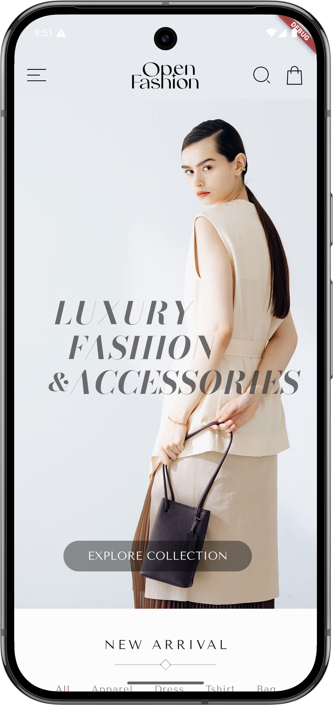
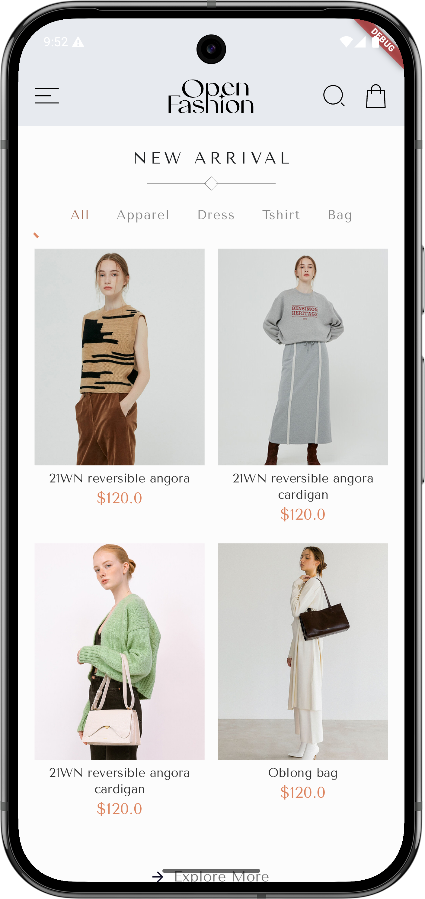
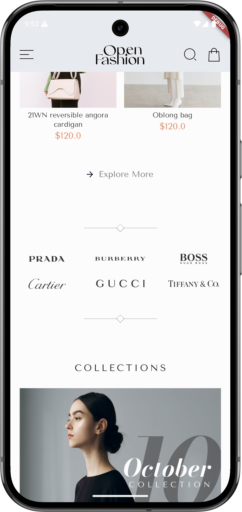
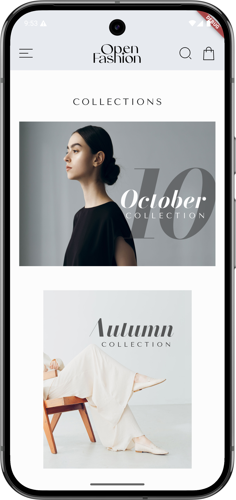
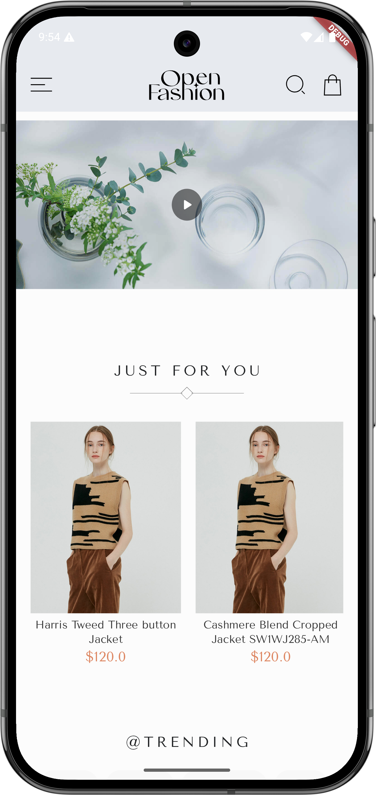
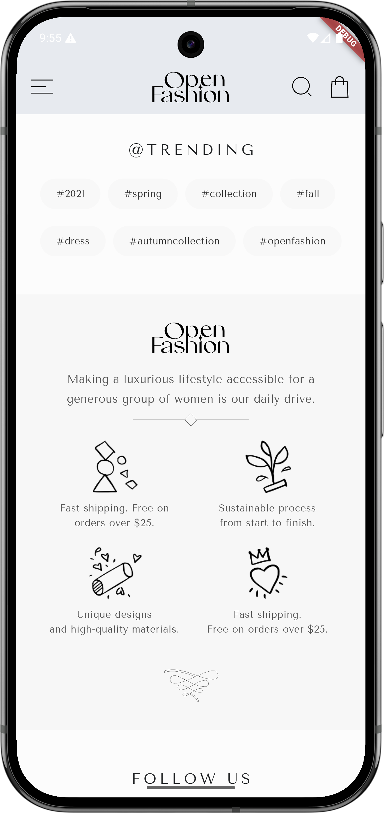
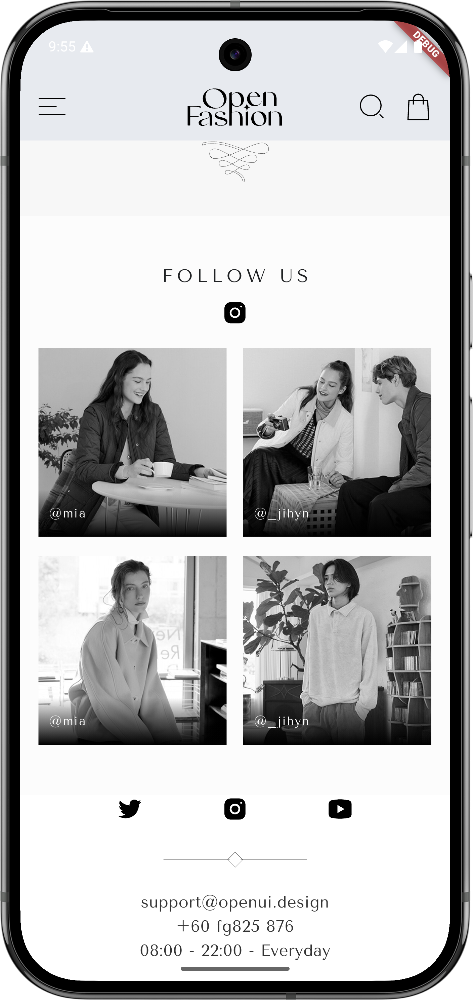
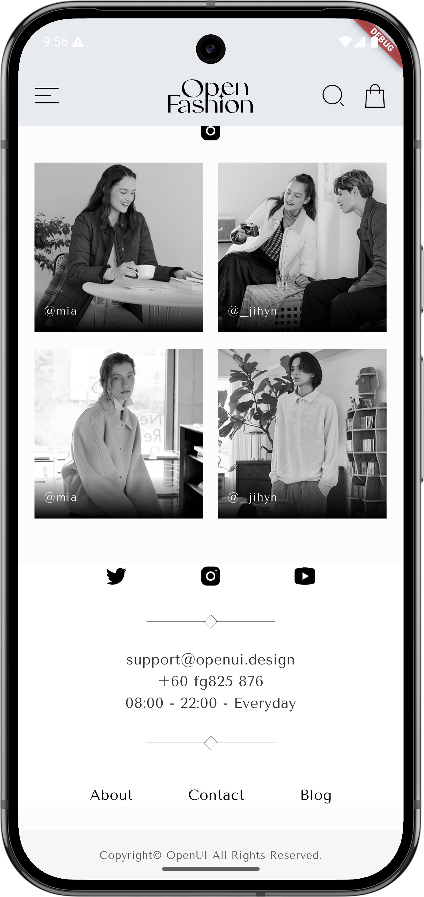

# 🛍️ Flutter Fashion E-Commerce UI Kit

A modern and responsive UI kit for fashion e-commerce applications built with Flutter. This project includes beautifully designed mobile screens for online fashion shopping platforms.

## 📸 Screenshots Preview
| Home 1 | Home 2 | Home 3 | Home 4 |
|--------|--------|--------|--------|
|  |  |  |  |

| Home 5 | Home 6 | Home 7 | Home 8 |
|--------|--------|--------|--------|
|  |  |  |  |

##  🎨 Design Source

Original Figma Design: [Free eCommerce UI Kit](https://www.figma.com/community/file/1055151140671808467)  
Designed by: [uistoredesign](https://www.figma.com/@uistoredesign)
